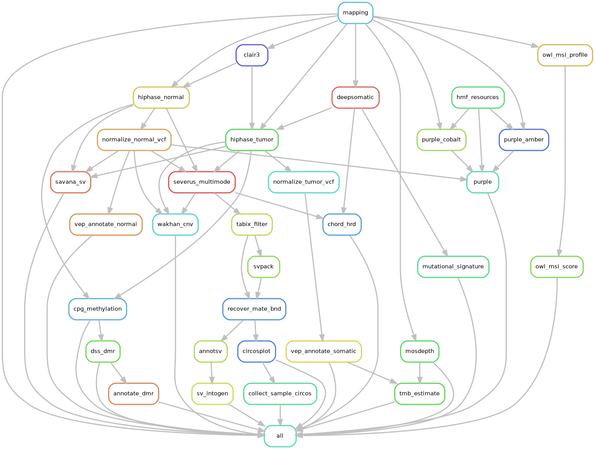

# LONG_READ_DNA_WGS

Snakemake workflow for somatic analysis of PacBio HiFi whole-genome sequencing, tumor against
matched normal.

Small variants (germline and somatic), structural variants, copy number with purity and ploidy,
CpG methylation and DMRs. HRD, MSI, TMB and mutational signatures are derived from those calls.
Output is organized per patient.

A patient can have more than one tumor sample: primary and metastasis, a relapse, a second biopsy.
All of them are analyzed against the same normal in one run. The cohort lives in a single TSV, so
adding a patient means adding rows.

Tool choices and filtering strategy were developed against PacBio's
[HiFi-somatic-WDL](https://github.com/PacificBiosciences/HiFi-somatic-WDL).

---

## Sample types

`NORMAL` is the control, and each patient needs exactly one. Everything else is a tumor sample. The
label is free text (`TUMOR`, `PRIMARY`, `META`, `RELAPSE`) and ends up in the output file names.

Alignment, coverage, Clair3 and methylation run once per sample, normal included. Somatic calling,
phasing, VEP, SAVANA, Wakhan, PURPLE, the biomarkers and DSS run once per tumor sample. The
per-patient stages are normal phasing and annotation, Severus, SV filtering and annotation, and
circos.

Severus is the one that matters here. It runs in multimode, normal as control and every tumor as a
target, so a patient with `NORMAL`, `PRIMARY` and `META` gets a single somatic SV VCF with a
genotype column per tumor. Breakpoints shared between primary and metastasis separate from private
ones directly in that VCF, with no second comparison. The circos step splits it back out per tumor
and writes a combined fusion table alongside.

Everything else scales with the tumor count: two somatic VCFs, two SAVANA and Wakhan and PURPLE
directories, two HRD predictions, two DMR comparisons against the same normal.

To keep two tumors apart entirely, give them separate `patient_id` values rather than separate
sample types. Each then needs its own `NORMAL` row and SVs are called separately.

## Workflow



| Stage | Tool | Rule |
|---|---|---|
| Alignment | pbmm2 | `mapping` |
| Coverage | mosdepth | `mosdepth` |
| Germline small variants | Clair3 | `clair3` |
| Somatic small variants | DeepSomatic | `deepsomatic` |
| Phasing | HiPhase | `hiphase_normal`, `hiphase_tumor` |
| VCF normalization | bcftools | `normalize_normal_vcf`, `normalize_tumor_vcf` |
| Variant annotation | VEP | `vep_annotate_normal`, `vep_annotate_somatic` |
| Structural variants | Severus (multimode) | `severus_multimode` |
| SV filtering | tabix, SVpack, mate-BND recovery | `tabix_filter`, `svpack`, `recover_mate_bnd` |
| SV annotation | AnnotSV, IntOGen cancer genes | `annotsv`, `sv_intogen` |
| Copy number | SAVANA, Wakhan | `savana_sv`, `wakhan_cnv` |
| Purity, ploidy, allele-specific CN | Amber, Cobalt, PURPLE | `purple_amber`, `purple_cobalt`, `purple` |
| HRD | CHORD | `chord_hrd` |
| Mutational signatures | MutationalPatterns | `mutational_signature` |
| MSI | owl | `owl_msi_profile`, `owl_msi_score` |
| TMB | tmb-calculator | `tmb_estimate` |
| Methylation | pb-CpG-tools | `cpg_methylation` |
| Differential methylation | DSS, annotatr | `dss_dmr`, `annotate_dmr` |
| Circos | bundled script | `circosplot`, `collect_sample_circos` |

SAVANA, Wakhan and PURPLE each estimate purity and ploidy. They disagree on low-purity samples.
We quote PURPLE and use the other two as a check.

## Running

```bash
mamba env create -f env.yaml
conda activate long_read_pipeline

cp samples.example.tumor_normal.tsv samples.tsv    # or samples.example.multi_tumor.tsv
vi samples.tsv                                     # patient, sample type, BAM path
vi config.yaml                                     # reference data and container paths

snakemake -n --cores 4                             # dry run
sbatch slurm/run_snakemake.sh                      # full cohort
bash slurm/run_patient.sh PT001 96                 # one patient
```

Sample sheet format:

```tsv
patient_id	sample_type	bam_path
PT001	NORMAL	/path/to/PT001_N.hifi_reads.bam
PT001	TUMOR	/path/to/PT001_T_1.hifi_reads.bam
PT001	TUMOR	/path/to/PT001_T_2.hifi_reads.bam
```

Repeating a patient and sample type, one row per SMRT cell, merges those BAMs during alignment.
`samples.tsv` is gitignored because it carries patient identifiers; only the anonymised examples are
tracked.

## Output

```
results/
├── shared/hmf_resources/   HMFtools reference bundle, unpacked once
└── PT001/
    ├── mapping/            aligned BAMs
    ├── qc/                 mosdepth coverage
    ├── snv/                Clair3 germline, DeepSomatic somatic
    ├── phasing/            HiPhase BAM and VCF, normalized VCFs
    ├── annotation/         VEP-annotated germline and somatic VCFs
    ├── sv/                 Severus, SVpack, AnnotSV, IntOGen hits, circos
    ├── cnv/                SAVANA, Wakhan, PURPLE
    ├── biomarkers/         HRD, mutational signatures, MSI, TMB
    ├── methylation/        5mC from pb-CpG-tools
    ├── dmr/                DSS differentially methylated regions
    └── logs/               one log per rule
```

## Input and disk

Input is unaligned BAM (`*.hifi_reads.bam`) as delivered by the instrument. In our breast cancer
cohort at roughly 30x, one SMRT cell is 200–370 GB, so a normal plus a two-cell tumor is about 1 TB
of input. Allow 2-3 TB of working space per patient for intermediates and results. Alignment is
where a run stops if the disk fills.

## Reference data

Code and small reference files are tracked here. The rest goes under `resource/`, which is
gitignored. See [docs/INSTALLATION.md](docs/INSTALLATION.md).

| config key | Content | Size |
|---|---|---|
| `reference_fasta` | GRCh38 no-alt analysis set | ~3 GB |
| `vep_cache` | VEP 112 RefSeq cache | ~26 GB |
| `annotsv_cache` | AnnotSV annotations | ~5 GB |
| `clair3`, `deepsomatic`, `savana`, `wakhan` containers | variant calling images | ~11 GB |
| `chord`, `somatic_r_tools`, `owl`, `tmb` containers | biomarker images | ~6 GB |
| `amber_jar`, `cobalt_jar`, `purple_jar`, `hmf_resources_tarball` | HMFtools | ~9 GB |
| `vntr_bed` | Severus VNTR BED | ~7 MB |
| `svpack_match_vcf`, `reference_gff` | SVpack control VCF, GFF3 | ~700 MB |
| `compendium_file` | IntOGen Compendium of Cancer Genes | ~1 MB |
| `mitelman_mcgene` | Mitelman database MCGENE dump | ~4 MB |

## Validation

Run end to end on a breast cancer cohort: three tumor/normal pairs and two patients with primary
and metastasis samples. Those two configurations used to be separate copies of the pipeline. After
merging them here, both still build a complete DAG:

| Configuration | Jobs |
|---|---|
| normal + tumor | 28 |
| normal + primary + metastasis | 40 |
| the same, with PURPLE and the biomarkers | 57 |

## Not included

CNVkit segmentation, the summary HTML report, seqkit and csvtk alignment statistics, tumor-only
mode, and ClairS as an alternative somatic caller. Somatic calling is DeepSomatic only.

## Credits

Reference workflow: [HiFi-somatic-WDL](https://github.com/PacificBiosciences/HiFi-somatic-WDL)
(PacBio). Follow its licence, and cite the tools it lists, when publishing results from this
workflow.

`scripts/svpack.py` comes from PacBio [svpack](https://github.com/PacificBiosciences/svpack).
`scripts/circosplot.py`, `scripts/DSS_tumor_normal.R` and `scripts/annotatr_dmr.R` are part of this
repository. The IntOGen Compendium of Cancer Genes and the Mitelman Database are used under their
own terms and are not redistributed here.

## Documentation

- [docs/USAGE.md](docs/USAGE.md): sample sheet, running individual stages, output structure
- [docs/OPERATIONS.md](docs/OPERATIONS.md): running, monitoring, troubleshooting
- [docs/INSTALLATION.md](docs/INSTALLATION.md): environment, containers, reference data
